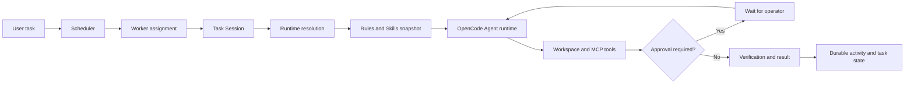

# Spacesly

Spacesly is a local AI engineering and agent-orchestration desktop application. It brings task planning, isolated workspaces, AI Agent Task Sessions, code editing, terminals, Git, Jira, and Model Context Protocol (MCP) tools into one Tauri application. Spacesly is intended for developers who want agents to do real repository and infrastructure work while retaining execution history, concurrency controls, and explicit approval for risky operations.

> Spacesly is under active development. Configuration formats and runtime behavior may change, and the project has not yet reached a stable release.

## Overview

Engineering work rarely lives in one place: a task may start in Jira, require a repository change, use a terminal or Git, query a Kubernetes cluster, and finish with a status update. Spacesly provides a local orchestration layer for that workflow.

The application combines:

- a local board for tasks and Jira issues;
- scheduler-backed Task Sessions executed by concurrent workers;
- direct AI-provider and OpenCode runtime options;
- workspace-aware editor, terminal, Git, search, and LSP tooling;
- stdio MCP connections and a built-in OpenShift/Kubernetes connector;
- durable activity, task progress, execution, and approval state.

## Why Spacesly?

General-purpose AI clients can call tools, but they often provide limited visibility into queued work, execution state, workspace boundaries, and operational approval. Spacesly makes these concerns part of the desktop workflow: a task is assigned to a durable Task Session, resolved against an immutable runtime configuration, executed within a workspace, and recorded as it progresses.

## Features

### Agent runtime

- Direct API runtimes for the configured OpenAI, Anthropic, Gemini, and DeepSeek profiles.
- OpenCode CLI integration using the user's existing local OpenCode authentication.
- Durable OpenCode session continuity across approval pauses and worker reassignment.
- Streaming chat, structured Agent Task results, and AI-proposed edit review.
- Backend-authoritative Skills and Rules resolution for scheduler-owned Task Sessions.

Scheduler-backed Agent Task Sessions currently use the OpenCode runtime. Direct provider APIs are available for supported chat/edit flows, but they are not a replacement for OpenCode in that scheduler path.

### Task orchestration

- Local and Jira-backed cards on a kanban-style board.
- Durable Task Sessions with queued, running, blocked, succeeded, failed, and cancelled lifecycle states.
- A five-worker scheduler pool with SQLite leases, assignment attempts, and fencing.
- Resume after approval without treating continuation as a new task or silently creating a new OpenCode session.
- Activity logs, task progress, retained results, cancellation, and restart recovery paths.

### Workspace and developer tools

- CodeMirror-based editor with syntax support for common web, systems, and configuration languages.
- Embedded PTY terminal through xterm.js and `portable-pty`.
- Git status, branch, staging, commit, push, pull, merge, and rebase operations.
- Configurable Language Server Protocol clients for completion, diagnostics, hover, navigation, symbols, references, and code actions.
- Workspace file browsing, watching, search/replace, formatting, and unsaved-file recovery snapshots.
- Workspace trust and canonical path checks for Agent file, shell, and Git tools.

### MCP and external tools

- Configurable stdio MCP servers with executable, ordered arguments, environment variables, routing domains, and intent terms.
- Cached MCP sessions with tool/schema discovery and connection testing.
- Specialized Jira configuration and board/issue synchronization through a configured Jira MCP server.
- Connector presets for generic MCP, Jira, OpenShift/Kubernetes, Bamboo, and Bitbucket. Except for the built-in OpenShift/Kubernetes connector and Jira-specific UI workflow, a preset does not provide an external service implementation—the configured MCP server supplies the tools.
- Assignment-bound MCP proxying for Agent runs.

### OpenShift and Kubernetes

The built-in OpenShift/Kubernetes MCP connector supports:

- kubeconfig, API-server token, and in-cluster ServiceAccount connection modes;
- connection preflight checks, timeouts, audit records, and circuit-breaker state;
- dynamically discovered generic Kubernetes resources, including custom resources;
- generic list, get, create, update, patch, and delete operations;
- namespace listing, event listing/filtering, workload inspection, pod logs, deployment restart/scale, and guarded managed-pod deletion;
- namespaced and cluster-scoped resources, Kubernetes RBAC errors, optimistic update checks through `resourceVersion`, JSON Merge Patch, RFC 6902 JSON Patch, and server-side apply.

Mutating Kubernetes operations require explicit operator approval. See [Current limitations](#current-limitations) for kubeconfig authentication constraints.

### Skills and Rules

- **Rules** are mandatory operating instructions applied before task-specific instructions.
- **Skills** are reusable execution guidance selected for a task by activation type, category/context match, manual request, and priority.
- Automatic, contextual, manual, and disabled Skill triggers are supported.
- The backend persists the authoritative selection result, catalog revision, matching reason, ordered selected Skills, Rules digest, provenance, and normalization version with the Task Session.
- A paused Task Session reuses its immutable Skills and Rules snapshot; reusable workers do not own this state.

### Safety and approval

- Risk-aware tool classification and capability checks.
- In-product **Approve** and **Decline** actions for operations that require operator confirmation.
- Approval is bound to the requested operation and argument digest and expires rather than authorizing unrelated calls.
- Assignment-local authority and fencing checks prevent stale workers from continuing to use Task Session tools.
- Agent edits are presented for review before application.

Approval controls reduce accidental execution; they do not make an untrusted MCP server, model provider, prompt, or cluster credential safe.

### Observability

- Local performance diagnostics for startup/TTI, frontend interactions, IPC, SQLite, runtime preparation, workspace resolution, MCP initialization, and schema discovery.
- Normal and opt-in Profiling modes with bounded in-memory retention.
- p50, p95, p99, maximum, rates, counters, and sanitized JSON export.
- Repeatable frontend, SQLite, and MCP benchmark harnesses.

Performance diagnostics are developer-facing and remain experimental. Metrics are held in memory and are not sent to an external telemetry service.

## How It Works



The Task Session owns execution context such as the OpenCode session ID and resolved Skills/Rules snapshot. Workers provide execution capacity and can be reused without owning or leaking Task Session state. Scheduler leases and fencing prevent two workers from driving the same assignment concurrently.

## Architecture

| Layer             | Implementation                          | Responsibility                                                                                                   |
| ----------------- | --------------------------------------- | ---------------------------------------------------------------------------------------------------------------- |
| Desktop shell     | Tauri 2                                 | Native window, IPC, dialogs, process lifecycle, and platform integration                                         |
| Frontend          | Svelte 5, SvelteKit, TypeScript, Vite   | Board, editor, terminal, Agent Console, Settings, and local projections                                          |
| Application layer | Rust                                    | Task execution, files, Git, Jira workflows, runtime resolution, and scheduling use cases                         |
| Domain layer      | Rust                                    | Execution contracts, Task Sessions, governance snapshots, and core state                                         |
| Infrastructure    | Rust                                    | SQLite stores, OpenCode/provider clients, MCP, Kubernetes, PTY, LSP, filesystem, secrets, and diagnostics        |
| Persistence       | SQLite, browser storage, and local JSON | Executions, scheduler state, runtime profiles, recovery data, settings, connector configuration, and credentials |

The Rust backend exposes typed Tauri commands to the renderer. Scheduler-owned Agent tools use assignment-local authority, while external MCP servers are started as stdio child processes and proxied through Spacesly's tool boundary.

On Linux, application data defaults to:

- `$XDG_DATA_HOME/spacesly/` or `~/.local/share/spacesly/` for SQLite databases;
- `$XDG_CONFIG_HOME/spacesly/` or `~/.config/spacesly/` for credentials and global environment configuration.

## Tech Stack

- Rust 2021 edition
- Tauri 2
- Svelte 5 and SvelteKit
- TypeScript and Vite
- Bun
- SQLite through `rusqlite`
- Model Context Protocol over stdio
- OpenCode CLI integration
- CodeMirror 6
- xterm.js and `portable-pty`

## Screenshots

No project screenshots are currently tracked in the repository. Screenshots should be added before a broader public launch so readers can evaluate the board, Agent Console, editor, and Settings experience.

## Requirements

Required for development:

- [Rust and Cargo](https://rustup.rs/) using a current stable toolchain;
- [Bun](https://bun.sh/);
- the operating-system prerequisites for [Tauri 2](https://v2.tauri.app/start/prerequisites/).

Optional runtime dependencies depend on the features you use:

- `opencode` for the OpenCode runtime and scheduler-backed Agent Task Sessions;
- `git` for source-control operations;
- language servers for LSP features;
- executable stdio MCP servers for external integrations;
- access to an AI provider when using a direct API runtime;
- a reachable Jira or Kubernetes/OpenShift service for those integrations.

## Installation

There are no published installers documented yet. Build and run Spacesly from source:

```bash
git clone https://github.com/Iqbalsonata30/spacesly.git
cd spacesly
bun install --frozen-lockfile
bun run tauri:dev
```

For OpenCode-backed execution, install OpenCode separately and authenticate before launching Spacesly:

```bash
opencode auth login
```

Then select **Settings → Agent → OpenCode OAuth**, verify the command/model, and use **Test Agent**.

## Development

Run commands from the repository root unless noted otherwise.

| Task                          | Command                                                                          |
| ----------------------------- | -------------------------------------------------------------------------------- |
| Frontend development server   | `bun run dev`                                                                    |
| Tauri development application | `bun run tauri:dev`                                                              |
| Frontend production build     | `bun run build`                                                                  |
| Desktop bundle                | `bun run tauri build`                                                            |
| Type/Svelte checks            | `bun run check`                                                                  |
| ESLint                        | `bun run lint`                                                                   |
| Frontend/unit tests           | `bun test`                                                                       |
| Playwright UI tests           | `bun run test:ui`                                                                |
| Responsive UI harness         | `bun run test:responsive`                                                        |
| Performance benchmark         | `bun run benchmark:performance`                                                  |
| Prettier check                | `bun run format:check`                                                           |
| Rust formatting check         | `cargo fmt --manifest-path src-tauri/Cargo.toml --check`                         |
| Rust lint                     | `cargo clippy --manifest-path src-tauri/Cargo.toml --all-targets -- -D warnings` |
| Rust tests                    | `cargo test --manifest-path src-tauri/Cargo.toml`                                |

The desktop bundle is created below `src-tauri/target/release/bundle/`. The current GitHub build workflow produces Linux `.deb`/AppImage artifacts and a Windows `.msi`; it does not currently build macOS artifacts.

See [Performance diagnostics](docs/performance-diagnostics.md) for profiling modes and benchmark procedures.

## Configuration

Configuration is managed through the Settings view:

1. **Agent** — choose a direct provider or OpenCode, model, temperature, command, and working directory.
2. **Agent Rules** — define global mandatory instructions for new Task Sessions.
3. **Skills** — create reusable guidance and choose automatic, contextual, manual, or disabled activation.
4. **MCP Connections** — configure the executable, ordered arguments, environment, connector type, and routing metadata.
5. **Jira Sync** — select a Jira MCP connection, authentication mode, board/project filters, pagination, and tool names.
6. **Global Environment** — manage enabled normal or secret environment variables injected into child processes.
7. **Theme** — choose system, light, or dark appearance.
8. **Performance Diagnostics** — inspect or export local metrics and opt into detailed profiling.

Do not place real credentials in documentation, issue reports, screenshots, shell history, or committed configuration files.

## MCP Integrations

An external MCP connection launches the configured executable with its ordered arguments and communicates over stdin/stdout. Spacesly initializes the server, discovers its tools and schemas, and can reuse a live session. Connector routing metadata helps the Agent runtime select relevant configured servers for a task.

Example launch configuration (illustrative only):

```text
Executable: npx
Arguments:
  - -y
  - example-mcp-package
```

Spacesly does not bundle the package in this example. Review an MCP server's source, permissions, and credential requirements before connecting it.

Spacesly itself provides two internal MCP-style boundaries:

- assignment-scoped workspace tools used for fenced file, shell, and Git access;
- the built-in OpenShift/Kubernetes connector described above.

Jira synchronization uses a separately configured Jira MCP server. Bamboo and Bitbucket are connection/routing presets for external MCP servers rather than built-in service clients.

## Agent Skills and Rules

Rules and Skills have different authority:

```text
Platform runtime instructions
→ global Agent Rules
→ selected Skills
→ task and execution context
```

Rules constrain how the Agent should operate. Skills provide reusable task knowledge. For new backend-authoritative Task Sessions, Spacesly resolves these once, persists the decision with the session, injects exactly that snapshot into the runtime, and reuses it after approval pauses. Changes made in Settings apply to new Task Sessions, not an already-running session.

Legacy Task Sessions created before structured resolution metadata are marked as legacy/unavailable rather than assigned fabricated selection reasons.

## Parallel Execution

The scheduler starts up to five execution workers. Queued Task Sessions are claimed with durable SQLite leases and fencing tokens. Each Task Session retains its own workspace, runtime profile, OpenCode session identity, connector set, Rules, and selected Skills. A released worker may later resume the same Task Session without becoming the owner of that state.

Separate direct Agent/chat runtime guards have their own concurrency limits; the five-worker value describes the scheduler Task Session pool, not every AI request path.

## Security

Spacesly executes AI-generated actions and external programs on the local machine. Treat that capability with the same care as shell access.

- Workspace-aware Agent tools validate canonical paths and bind access to the active Task Session assignment.
- Tool grants, assignment attempts, lease expiry, and fencing are checked before protected operations.
- Operations classified as requiring approval surface **Approve** and **Decline** controls; approvals are scoped to a specific operation and argument digest.
- Kubernetes mutations are guarded and still subject to the connected identity's RBAC permissions.
- MCP environment values and provider/Jira credentials are not returned wholesale to the renderer; secret values are redacted from supported diagnostic paths.
- Tauri uses a restrictive content security policy.

Current credential-storage limitation: application credentials are stored in a local JSON file (`secrets.json`). On Unix, Spacesly sets the configuration directory to mode `0700` and the file to `0600`; the data is not encrypted at rest and equivalent permission hardening is not implemented by this code on non-Unix platforms. Protect the user account and disk, and do not use production credentials on an untrusted machine.

External MCP servers are child processes with the environment and access available to their configuration. Only install and configure servers you trust. Spacesly's approval layer does not audit or sandbox the implementation of a third-party MCP server.

**Never commit secrets. Do not put production credentials in examples.**

For public disclosure procedures, note that this repository does not yet include a `SECURITY.md` policy.

## Privacy

Spacesly has no required Spacesly-hosted cloud service and stores its application state locally. That does not mean all task data stays on the machine:

- prompts and included workspace/task context are sent to the selected AI provider, either directly or through OpenCode's configured provider;
- configured MCP servers receive tool requests and may communicate with their own external services;
- Jira synchronization sends requests to the configured Jira MCP server and Jira instance;
- the OpenShift/Kubernetes connector sends requests to the configured cluster API;
- shell, Git, LSP, and other child processes can access data permitted by their local configuration.

Performance metrics are local and in-memory by default. A diagnostics export is written only when the user requests it and excludes prompt text, tool payloads, environment values, credentials, and response bodies by design.

## Current Limitations

- Spacesly is version `0.1.0` and under active development; persisted formats and settings may change.
- There are no documented published installers, compatibility matrix, or stable release support policy.
- Scheduler-backed Agent Task Sessions require OpenCode.
- External MCP connectivity currently targets stdio servers; network transports are not exposed as connection types.
- The built-in Kubernetes connector does not support kubeconfig `exec` authentication plugins. Use a kubeconfig with supported static credentials, API-server token mode, or in-cluster credentials.
- Local credentials are owner-restricted on Unix but are not encrypted at rest.
- Performance diagnostics and benchmark baselines are engineering tools, not a remote monitoring platform.
- The repository currently lacks a license grant and standard public contribution/security policy files.

## Roadmap

Near-term public-release work should focus on:

- a secure cross-platform credential backend;
- clearer integration setup and troubleshooting documentation;
- broader real-environment and cross-platform test coverage;
- stable packaging, release notes, and compatibility guidance;
- screenshots and contributor/security governance files.

No release dates are committed.

## Contributing

Until a dedicated `CONTRIBUTING.md` exists:

1. Fork the repository and create a focused branch.
2. Keep changes scoped and preserve Task Session, approval, workspace-isolation, and fencing semantics.
3. Run the relevant checks from the [Development](#development) section.
4. Include tests for behavior changes.
5. Open a pull request explaining the problem, implementation, validation, and any security or migration impact.

The CI workflow checks formatting, ESLint, Svelte/TypeScript, Bun tests, Playwright tests, the frontend build, Rust clippy/tests, and dependency audits.

## License

No `LICENSE` file currently exists. Although `package.json` contains `"license": "MIT"`, that metadata is not a substitute for a repository license grant. Add a LICENSE file before treating Spacesly as open-source or accepting outside contributions.
